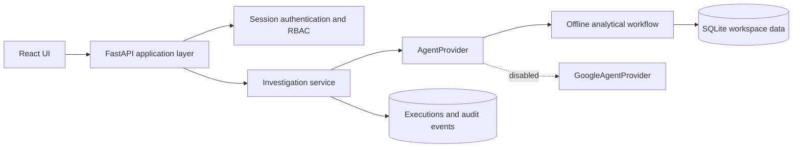

# Northstar Intelligence

Northstar Intelligence is an enterprise customer and product intelligence portfolio application. It combines quarterly revenue, customer-support signals, and effective warranty policies into an evidence-led investigation with an auditable execution trail.

The current application runs fully offline. Google Cloud execution, resource creation, and billing are blocked in code and Terraform until the owner explicitly approves a one-time live test.

## What is implemented

| Area | Implementation |
|---|---|
| Product experience | Responsive React workspace, professional sign-in, dashboard, investigations, agent catalogue, operations, access governance, and settings |
| Business intelligence | INR revenue KPIs, quarterly and monthly trends, regional contribution, product performance, and complaint distributions |
| Agent experience | `AgentProvider` boundary, offline provider, disabled Google provider, streamed execution stages, history, evidence, and report approval |
| Identity and security | Scrypt passwords, opaque server sessions, HttpOnly cookies, CSRF checks, trusted hosts, backend RBAC, tenant/owner scoping, input validation, rate limiting, and audit events |
| Engineering | Strict TypeScript, Zod response contracts, React Query, centralized API errors, Pydantic request contracts, service layer, structured request logging, and atomic execution commits |
| Observability | Actual request latency, workflow outcomes, active sessions, error rates, audit history, and explicit zero model usage while cloud execution is blocked |
| Verification | 42 backend tests and 4 Playwright journeys, including WCAG automated checks |

The repository includes a versioned fictional Indian enterprise dataset so reviewers can reproduce the same decisions. Operational metrics are always measured from actual application activity and are never seeded.

## Architecture



The frontend never receives credentials and never calls an AI provider directly.

## Run on Windows

Requirements: Python 3.10+ and Node.js 22.12+.

```powershell
python -m venv .venv
.\.venv\Scripts\python.exe -m pip install -r requirements.lock.txt
.\.venv\Scripts\python.exe -m pip install --no-deps -e .
Set-Location frontend
npm.cmd ci
Set-Location ..
powershell.exe -ExecutionPolicy Bypass -File scripts\start-local.ps1
```

Open `http://127.0.0.1:5173`. The first startup creates private workspace credentials in `.local/local-accounts.json`; the file is ignored by Git. The app binds to loopback only.

Check both services or recover them with:

```powershell
powershell.exe -ExecutionPolicy Bypass -File scripts\status-local.ps1
powershell.exe -ExecutionPolicy Bypass -File scripts\restart-local.ps1
```

The launcher verifies the API, database readiness and login page before reporting success. If either process fails during startup, it stops the other process and points to the local error logs.

To stop both recorded project processes:

```powershell
powershell.exe -ExecutionPolicy Bypass -File scripts\stop-local.ps1
```

For stable credentials in a private development environment, copy `.env.example` to `.env` and set a strong `BOOTSTRAP_PASSWORD` before creating the database. Never deploy the bootstrap login mechanism.

## Verify

```powershell
.\.venv\Scripts\python.exe -m pytest -q
.\.venv\Scripts\python.exe -m ruff check backend tests
Set-Location frontend
npm.cmd run build
npm.cmd run test:e2e
```

## Included workspace scenario

- Northstar Electronics India and Meridian Retail Systems are fictional and tenant-isolated.
- Revenue is stored as integer paise and displayed using Indian INR grouping and lakh/crore notation.
- Ananya Rao can run evidence-led product investigations.
- Rahul Menon can review support/policy capabilities but cannot access sales or execute the combined workflow.
- Arjun Iyer can review operations, audit activity, and role assignments.
- Atlas Pro 14 and Orbit View 27 cross the default decline threshold; findings link revenue, ticket, and policy evidence.

Complaint counts represent tickets rather than unique customers. Recommendations remain hypotheses and actions; they do not claim causation or guarantee warranty coverage.

## Google Cloud status and cost

No live Google flow has been run. Configuring a project, model, or credentials does not bypass `cost_policy.py`, and Terraform rejects cloud provisioning.

## Project layout

```text
backend/intelligence/  API, authentication, RBAC, services, providers, analytics, storage
frontend/src/          Design system, routes, pages, API contracts, session state
frontend/tests/        Browser, workflow, RBAC, export, and accessibility journeys
tests/                 API, domain, provider, SQL policy, and cost guard tests
docs/                  Architecture, migration, security, verification, and customer brief
infrastructure/        Guarded Google Cloud foundation; cannot currently apply
scripts/               Local lifecycle, evaluation, and blocked cloud smoke entry point
```

## Honest portfolio claim

Describe this as an offline production-style reference implementation with a tested provider boundary. Claim a Google Agent Engine or Gemini Enterprise integration only after completing and recording the separately approved live test.
